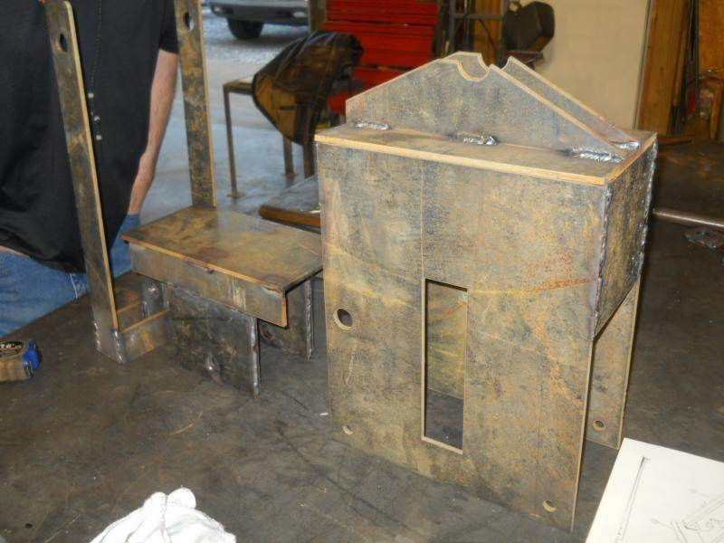
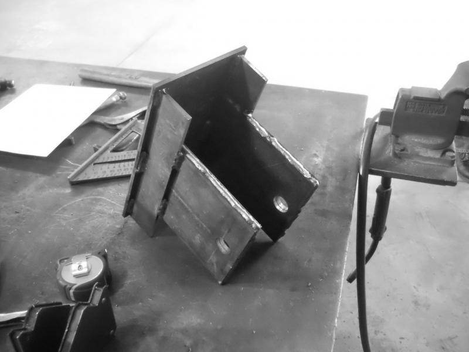
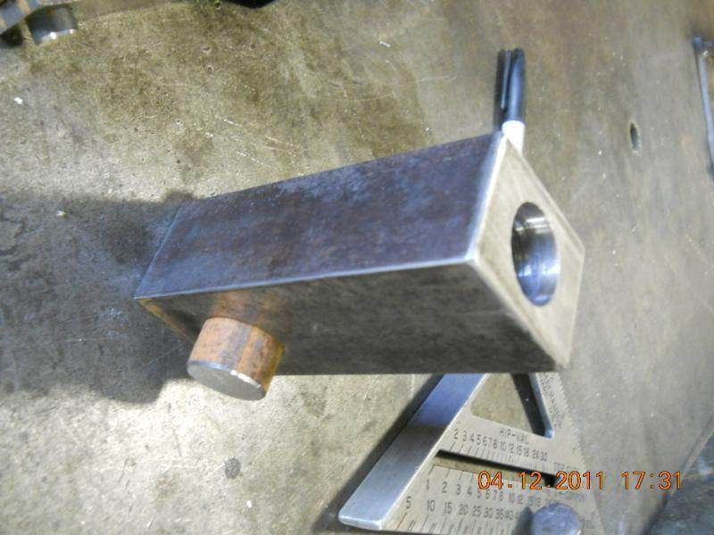
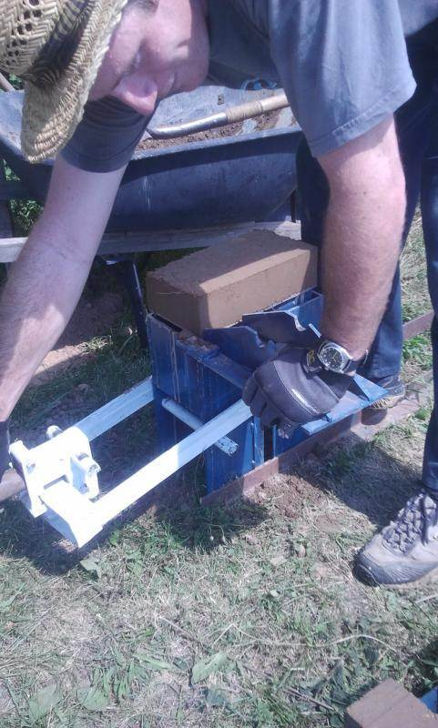

# CINVA-Ram Block Press

OpenSCAD model of a CINVA-Ram compressed earth block press.
All dimensions in inches. Material: 1/4" (0.250") steel plate unless noted.

Primary file: `cinva_ram.scad`

## Parts by Assembly

### Brown — Pivot assembly (moves along ramp)
| Part       | Description                                                     |
|------------|-----------------------------------------------------------------|
| **Pivot**  | Solid 2x2x6 block — holds handle, wings/tails pivot around it   |
| **Wing**   | Long toggle link (2 holes) — connects spacer pin to roller pin  |
| **Tail**   | Short toggle link (1 hole) — connects spacer pin to pivot block |
| **Handle** | 6' round bar in pivot sunk hole (cylinder, no module)           |

### Orange — Lever assembly (pivots around load pin)
| Part                   | Description                                                                    |
|------------------------|--------------------------------------------------------------------------------|
| **Lever bar**          | Long arm the operator pulls to press the brick (inline, `lever_bar_profile()`) |
| **Cross**              | Cross bars welded between lever bars at grip end (inline cubes)                |
| **Lever spacer block** | Block between crosses with roller hole (inline cube)                           |

### Pink — Clamp (rotates on axle)
| Part       | Description                                                        |
|------------|--------------------------------------------------------------------|
| **Clamp**  | Hook-shaped bracket on axle that grabs the cross to lock the lever |
| **Grabber** | Plate between left and right clamp brackets                       |

### Purple — Pins and bars (round stock)
| Part            | Description                                          |
|-----------------|------------------------------------------------------|
| **Fulcrum Pin** | Fixed pin through side plate holes                   |
| **Load Pin**    | Pin in side slots, rises with lever mechanism        |
| **Roller**      | Rolls along ramp surface, drives the lever           |
| **Spacer Pin**  | Through pivot/wing upper holes, moves with assembly  |
| **Axle**        | 7/16" pin through front block, clamp rotates on this |

### Teal — Shelf assembly (rises to press brick)
| Part        | Description                                                 |
|-------------|-------------------------------------------------------------|
| **Shelf**   | Flat plate the brick sits on, rises in the side slots       |
| **Bracket** | Vertical brace under shelf, connects shelf to piston plates |
| **Piston**  | Vertical plate pair connecting shelf to load pin            |

### Red — Ramps and Top
| Part     | Description                                                                 |
|----------|-----------------------------------------------------------------------------|
| **Top**  | Flat plate on top of side plates — ramps sit on this                        |
| **Ramp** | V-shaped profile the roller rolls along to convert pull into downward press |

### Gray (ghost) — Structure
| Part         | Description                                                     |
|--------------|-----------------------------------------------------------------|
| **Side**     | Tall vertical plate with piston slot, bolted to feet            |
| **EndPlate** | Plate welded to shelf front/back edges, forms the brick chamber |

### White — Hinge (Top+Ramps swing open to eject brick)
| Part           | Description                                                   |
|----------------|---------------------------------------------------------------|
| **Receiver**   | Cylinder with 0.5" hole welded to Side plate — receives the pin |
| **Tab**        | Tapered bracket welded to Top plate — butts against Ramp, conforms to Receiver |
| **Pin**        | 0.5" dia cylinder welded to Tab, drops into Receiver            |

### Green — Base
| Part             | Description                                                        |
|------------------|--------------------------------------------------------------------|
| **Base_Bracket** | L-shaped feet — bolts to ground, side plates mount to vertical leg |

## Animation

The model animates with OpenSCAD's `$t` variable (0 to 1):
- **t=0**: Roller at right side of ramp, lever tilted right
- **t=0.5**: Roller near peak, lever nearly vertical
- **t=1**: Roller past peak on left slope, lever tilted left

To render specific frames from the command line:
```
openscad -o frame.png -D '_t_override=0.5' cinva_ram.scad
```

## DXF Export

Run `export_dxf.sh` to export 2D projections of all parts as DXF files in `./dxf/`:
```
bash export_dxf.sh
```

## Reference Drawings

| Drawing | Description |
|---------|-------------|
| cinva1.jpg | Sheet 1 — EndPlate (brick chamber walls) |
| cinva2.jpg | Sheet 2 — Wing and Tail (toggle links) |
| cinva3.jpg | Sheet 3 — Clamp bracket |
| cinva4.jpg | Sheet 4 — Lever bars and cross bars |
| cinva5.jpg | Sheet 5 — Ramp profile |
| cinva6.jpg | Sheet 6 — Side plate details |
| cinva7.jpg | Sheet 7 — Side plate and Piston |

## Reference Photos

| Photo | Description |
|-------|-------------|
|  | Baseboard frame and mold box sub-assemblies before final assembly |
|  | Mold box welded, cover open showing hinge and interior |
|  | Piston body close-up — rectangular with pivot hole and bronze bushing |
|  | Complete press in use, ejecting a compressed earth block |

---

# CETA-RAM Brick Making Machine

OpenSCAD and FreeCAD models of the CETA-RAM compressed earth block press,
based on the OHO e.V. engineering drawings (CC-BY-SA 4.0).

Brick size: **12" x 6" x ~4"** (compressed)

## Files

| File | Description |
|------|-------------|
| `ceta-ram/ceta_ram.scad` | OpenSCAD model — metric (mm), all 6 assemblies |
| `ceta-ram/ceta_ram_imperial.scad` | OpenSCAD model — imperial (inches), US steel sizes |
| `ceta-ram/ceta_ram_imperial.py` | FreeCAD Python macro — imperial, parametric |
| `ceta-ram/CETA_RAM_Imperial.FCStd` | Pre-built FreeCAD file (open directly) |
| `ceta-ram/CETA-RAM_Reference.md` | Complete BOM and dimensions from OHO drawings |

## Imperial Steel Sizes

| Metric | Imperial | Use |
|--------|----------|-----|
| 13mm plate | 1/2" | Sides, supports, brackets |
| 10mm plate | 3/8" | Base, top, piston plates |
| 6mm plate | 1/4" | Cap plate, side levers |
| 152x52x8 C-channel | C6x8.2 | Beams (2 pcs @ 18") |
| ∅60 rod | 2-3/8" | Main bars (2 pcs @ 18") |
| ∅44 rod | 1-3/4" | Handle (17-3/4") |
| ∅32 rod | 1-1/4" | Pins and rods |
| ∅20 rod | 3/4" | Support rod |
| ∅12 rod | 1/2" | Small pin |
| ∅70/60 tube | 2-3/4" OD / 2-3/8" ID | Piston rods |
| ∅44/32 tube | 1-3/4" OD / 1-1/4" ID | Piston rod 1, cap |
| ∅50/32 tube | 2" OD / 1-1/4" ID | Bushings |
| ∅40/20 tube | 1-1/2" OD / 3/4" ID | Support tubes |
| 2"x2"x1/4" angle | — | Cover levers (2 pcs @ 9-1/16") |
| M12/M14 bolts | 1/2"-13 | All fasteners |

## Reference Data

| Source | Location |
|--------|----------|
| Engineering drawings (53 pages) | `ceta-ram/pdf/` |
| STEP files (6 sub-assemblies) | `ceta-ram/cad/STP-files/Stp/` |
| Autodesk Inventor files | `ceta-ram/cad/CAD-files/Cad/` |
| AutoCAD 2D drawings | `ceta-ram/cad/DWG-files/` |
| Photos/renders | `ceta-ram/images/` |
