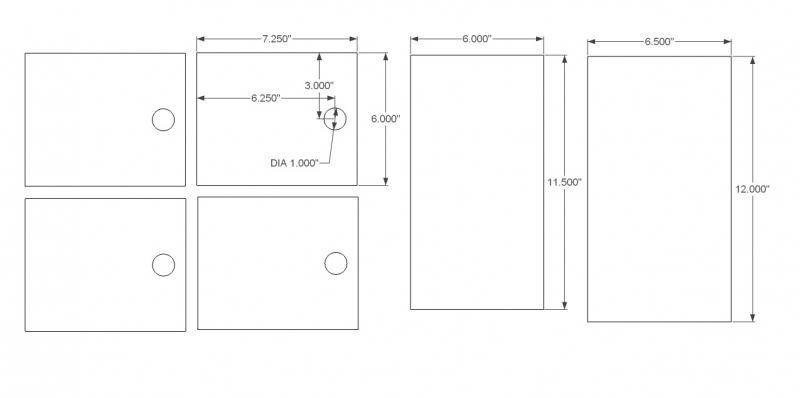
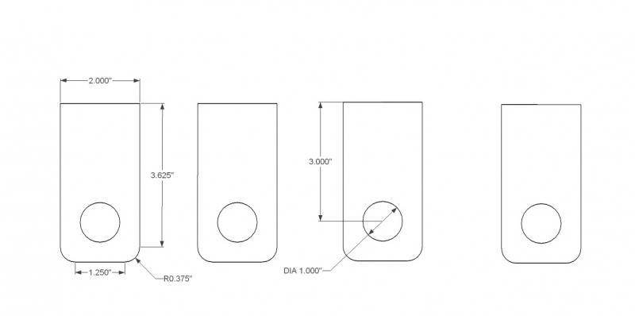
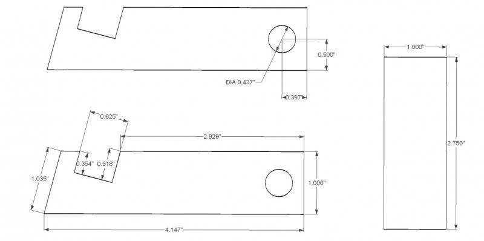
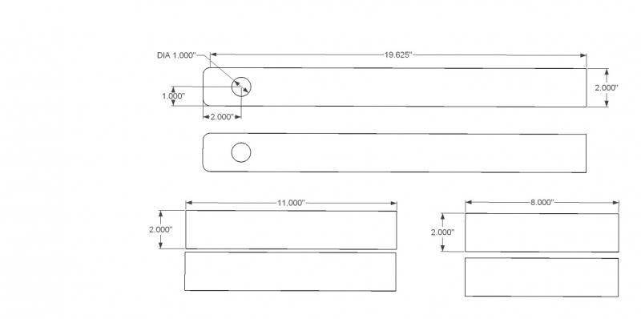
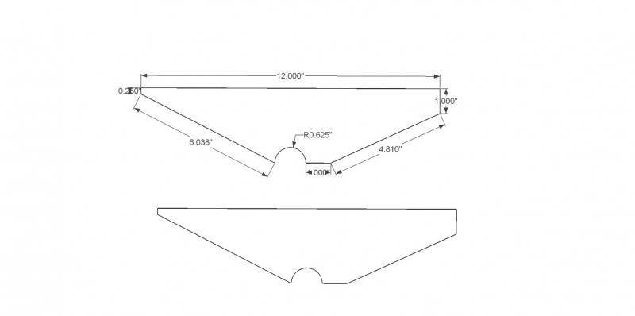
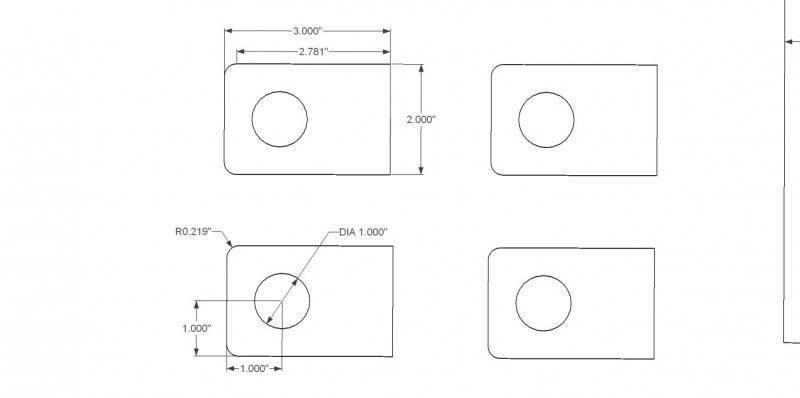
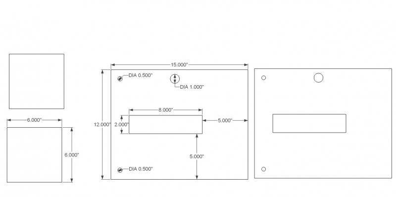

# CINVA-Ram Block Press

All parts are 1/4" (0.250") steel plate unless otherwise noted.


## Parts List

| Label | Part |
|-------|------|
| A | Cover |
| B | Upper Saddle |
| C | Mold Box |
| D | Baseboard |
| E & F | Upper Adjusting Bolts |
| G & H | Lower Adjusting Bolts |
| I & J | Guide Plates |
| K | Piston |
| L | Lower Rollers |
| M | Lever Latch |
| N | Handle |

---

## Cut List

All 1/4" steel plate. Quantities are total pieces to cut.

| # | Part | Qty | Size (W x H) | Holes / Features |
|---|------|-----|---------------|------------------|
| 1 | Mold Box Side Wall (C) | 2 | 7.250" x 6.000" | 1.000" dia hole at 3.000" from top, 6.250" from left |
| 2 | Mold Box End Wall, short (C) | 1 | 6.000" x 11.500" | None |
| 3 | Mold Box End Wall, tall (C) | 1 | 6.500" x 12.000" | None |
| 4 | Toggle Link, long | 2 | 2.000" x 3.625" | 1.000" dia hole, 1.250" from bottom center; R0.375" bottom corners |
| 5 | Toggle Link, short | 2 | 2.000" x 3.000" | 1.000" dia hole at bottom center; R0.375" bottom corners |
| 6 | Latch Bracket (M) | 2 | 4.147" x 1.035" | L-profile; step notch 0.625" x 0.354"/0.518"; 0.437" dia hole at 0.500"/0.397" from edges |
| 7 | Latch Spacer (M) | 1 | 1.000" x 2.750" | None |
| 8 | Handle Bar (N) | 2 | 19.625" x 2.000" | 1.000" dia hole at 1.000" from end, centered on width |
| 9 | Handle Cross Bar, upper | 1 | 11.000" x 2.000" | None |
| 10 | Handle Cross Bar, lower | 1 | 8.000" x 2.000" | None |
| 11 | Cover (A) | 1 | 12.000" wide (flat) | Bent to V-shape; left leg 6.038", right leg 4.810"; R0.625" semicircular notch at bottom center; edges 0.250" and 1.000" |
| 12 | Bearing Plate, large (B) | 2 | 3.000" x 2.000" | 1.000" dia hole centered at 2.781" from edge; R0.219" corner radii |
| 13 | Bearing Plate, small (B) | 2 | 3.000" x 2.000" | 1.000" dia hole at 1.000" from bottom, 1.000" from left |
| 14 | Side (D) | 2 | 15.000" x 12.000" | 1.000" dia hole (pivot); 2x 0.500" dia mounting holes near bottom (for bolting to feet); 8.000" x 1.000" rectangular piston slot |
| 15 | Shelf (K) | 1 | 6.000" x 12.000" | None |
| 16 | Base Bracket | 2 | 4'-0" (48") long, 2" x 2" L-shape | 3x 0.500" dia bolt holes in horizontal leg (3" from each end + center) |

**Total pieces: 24**

---

## Drawing Details

### Sheet 1 — Mold Box Walls (Part C)



Four panels forming the rectangular mold cavity. The two side walls (7.250" x 6.000") each have a 1.000" dia pivot hole. The two end walls are different heights — 11.500" and 12.000" — to allow for the cover hinge offset.

### Sheet 2 — Toggle Links



Four toggle link pieces connecting the handle lever to the piston. Two long links (3.625") and two short links (3.000"), all 2.000" wide with 1.000" dia pin holes and R0.375" radiused bottom corners.

### Sheet 3 — Lever Latch (Part M)



Two L-shaped latch brackets and one spacer. The brackets have a step notch (0.625" wide, 0.354"/0.518" deep) and a 0.437" (7/16") dia hole positioned 0.500" from the edge and 0.397" from the top. The spacer is a plain 1.000" x 2.750" rectangle.

### Sheet 4 — Handle (Part N) and Cross Bars



Two handle bars (19.625" x 2.000") with a 1.000" dia pivot hole 1.000" from one end. Two cross bars (11.000" and 8.000", both 2.000" wide) weld between the handle bars to form the lever assembly.

### Sheet 5 — Cover (Part A)



Single plate bent into a V-shape to form the hinged mold cover. Flat width is 12.000". When bent, the left leg is 6.038" and the right leg is 4.810". A R0.625" semicircular notch at the bottom center clears the toggle pivot pin. Top view (below) shows the trapezoidal flat pattern.

### Sheet 6 — Bearing Plates (Part B — Upper Saddle)



Four bearing plates for pivot points. Two larger plates (3.000" x 2.000") with the 1.000" dia hole centered at 2.781" from the edge and R0.219" corner radii. Two smaller plates with the 1.000" dia hole at 1.000" from bottom and 1.000" from the left edge.

### Sheet 7 — Baseboard (Part D) and Piston Cap (Part K)



The baseboard (15.000" x 12.000") is the main structural plate. It has a 1.000" dia hole for the toggle pivot, two 0.500" dia holes for adjusting bolts, and an 8.000" x 2.000" rectangular slot (5.000" from bottom, 5.000" from right) for piston travel. The piston cap is a plain 6.000" x 6.000" square plate.

---

## 3D Models

### FreeCAD (`cinva_ram.py`)

Run as a FreeCAD macro to generate solid models of all 22 parts:

```
FreeCAD > Macro > Execute Macro > cinva_ram.py
```

Dimensions converted from inches to mm internally. Parts are created as individual `Part::Feature` objects named by label (e.g. `C_SideWall_1`, `N_HandleBar_1`).

### OpenSCAD (`cinva_ram.scad`)

Open in OpenSCAD. All 24 parts are laid out in rows by default. Each part is a separate module you can call individually:

```
C_SideWall()          C_EndWall_Short()     C_EndWall_Tall()
ToggleLink_Long()     ToggleLink_Short()
M_LatchBracket()      M_LatchSpacer()
N_HandleBar()         N_CrossBar_Upper()    N_CrossBar_Lower()
A_Cover()
B_BearingPlate_Large()  B_BearingPlate_Small()
D_Baseboard()         K_PistonCap()
Foot_Bracket()
```

Units are inches. `$fn = 64` for circle resolution.

### Assembly Model (`cinva_assembly.scad`)

3D assembly with all parts positioned as built. Uses modules from `cinva_ram.scad`.

Adjustable parameters at the top of the file:
- `piston_rise` — move the piston up (0 = retracted, ~4 = pressed)
- `handle_angle` — handle position in degrees (0 = horizontal, 45 = raised)
- `cover_angle` — cover open angle (0 = closed, 70 = open)

Each sub-assembly is a separate module and color-coded for clarity.

See also: [Assembly & Welding Guide](ASSEMBLY.md)

---

## Reference Photos

| Photo | Description |
|-------|-------------|
|  | Baseboard frame and mold box sub-assemblies before final assembly |
|  | Mold box welded, cover open showing hinge and interior |
|  | Piston body close-up — rectangular with pivot hole and bronze bushing |
|  | Complete press in use, ejecting a compressed earth block |
